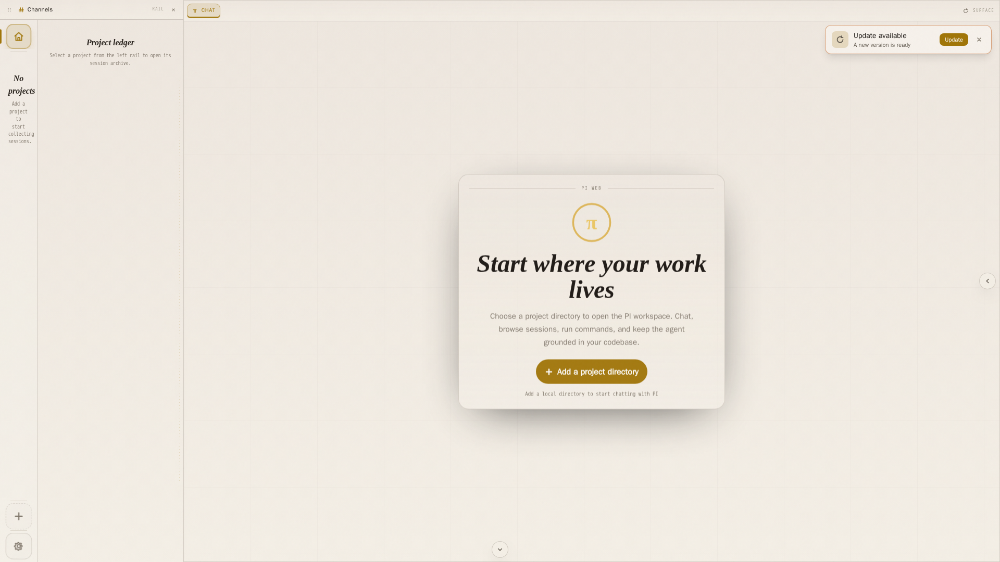
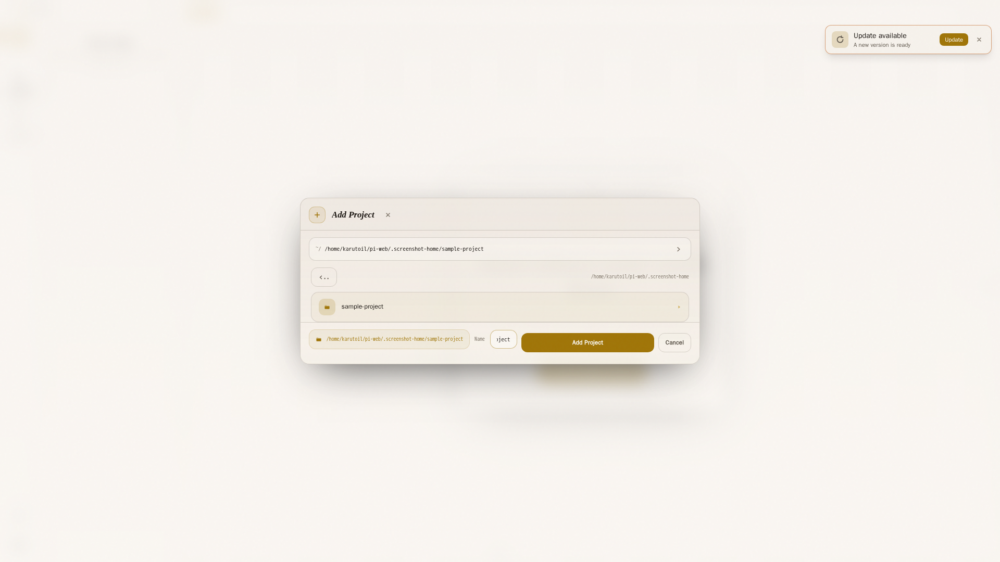
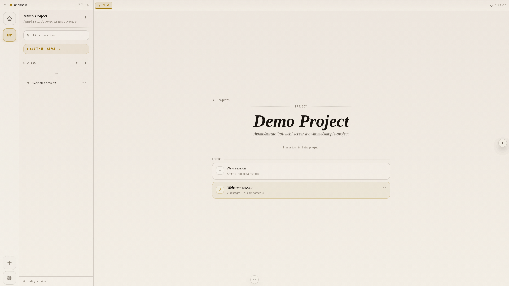
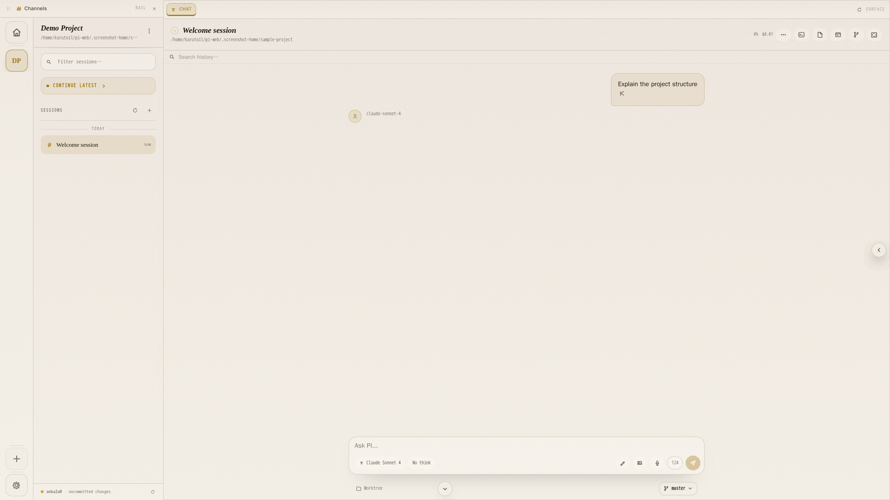
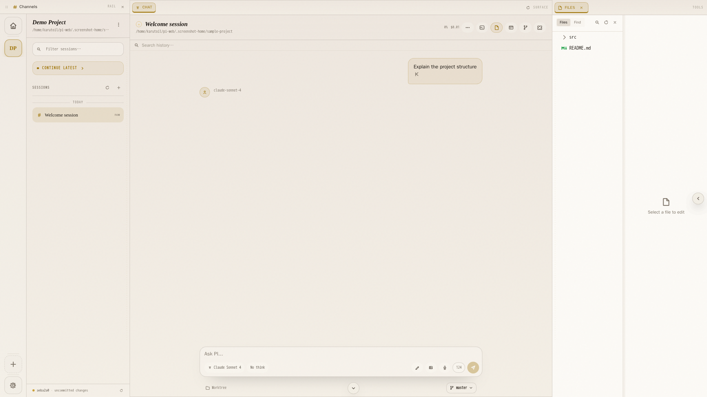
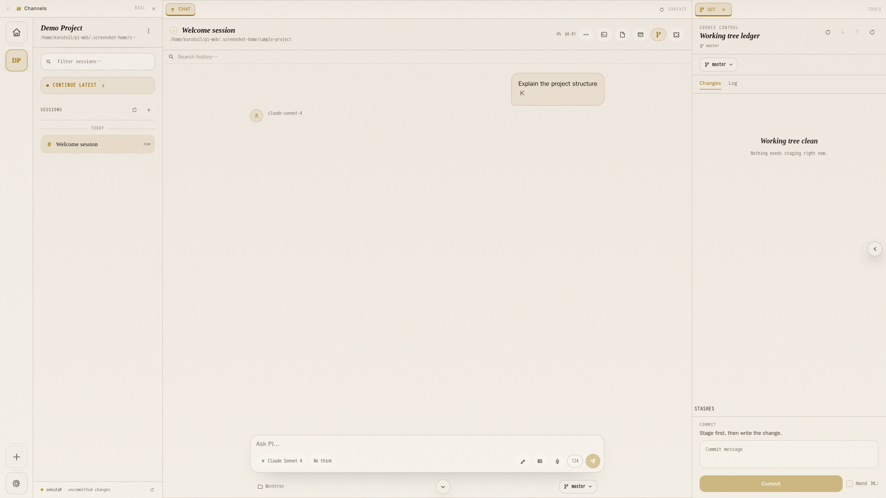
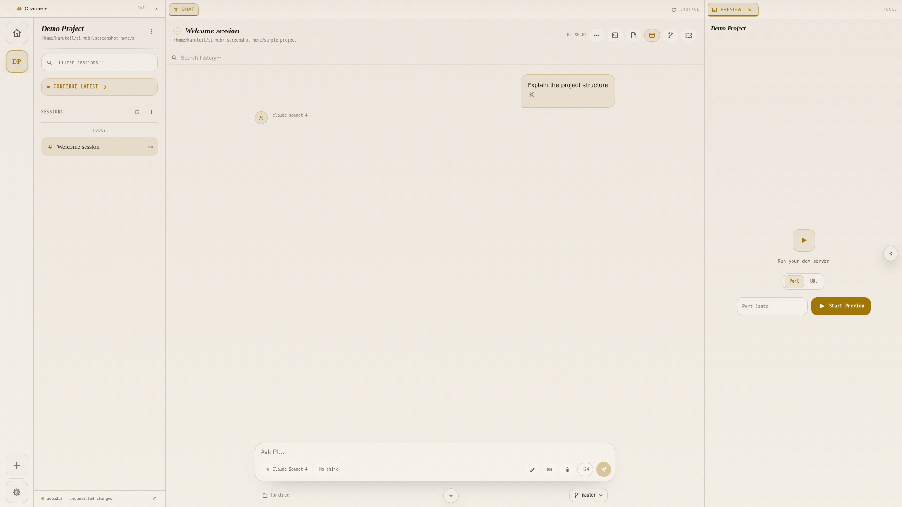
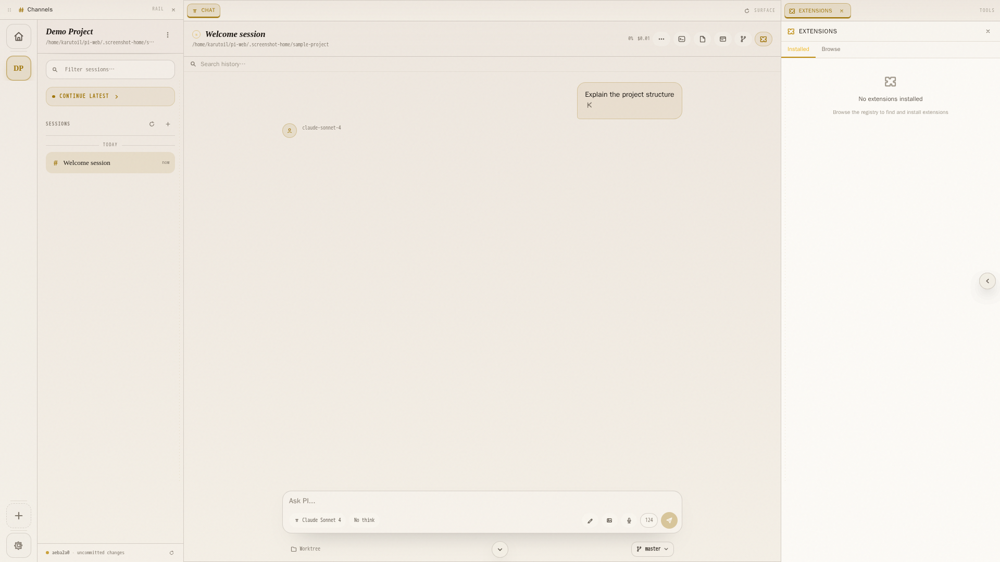
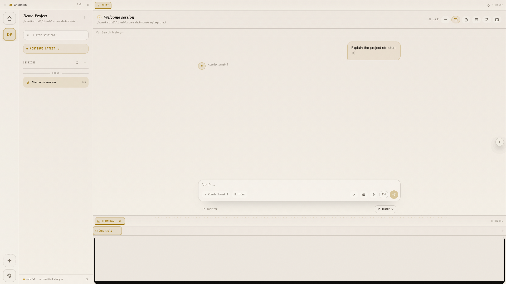
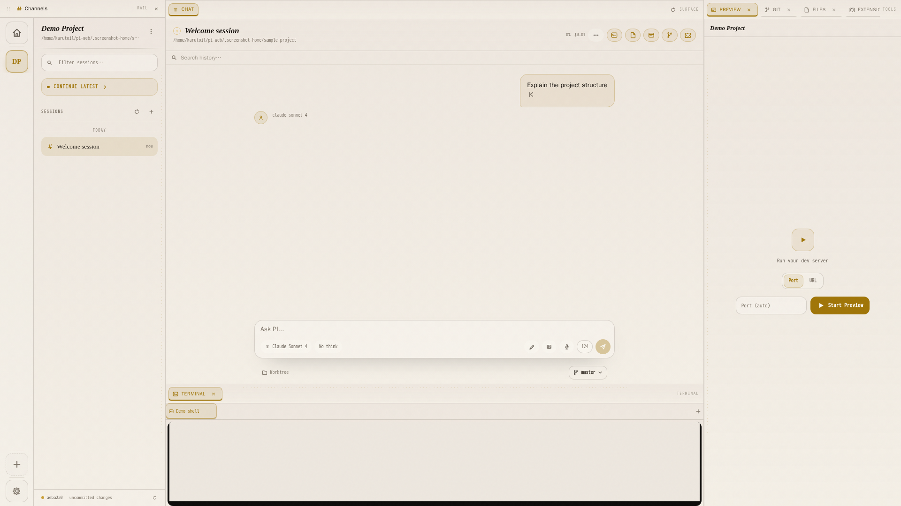

# PI Web

A beautiful, real-time web interface for the [PI coding agent](https://pi.dev).

Built with **Bun + Hono + React 19 + Tailwind CSS v4** and PI's native RPC mode for first-class streaming support.

## Features

- **Project Management** — Add local directories as projects
- **Session Browser** — View all PI sessions for a project, see message count, model, timestamps
- **Real-time Chat** — Full streaming support via PI's RPC mode over WebSocket
- **Tool Execution** — Live tool call display (read, bash, edit, write, grep, find, ls)
- **Thinking Display** — Toggle thinking/reasoning visibility
- **Markdown Rendering** — Full GFM with code highlighting
- **Steer & Abort** — Steer conversations mid-stream or abort long operations
- **Historical Sessions** — Load and browse past sessions with full message history
- **Usage Tracking** — Aggregate token/cost roll-up across all sessions, per project and per model, in Settings → Usage
- **Full PI Settings UI** — Structured editor for every PI settings.json option (model, compaction, retry, resources, subagents, …) plus a raw JSON escape hatch
## Tech Stack

| Layer    | Technology                    |
|----------|-------------------------------|
| Runtime  | Bun                           |
| Server   | Hono (HTTP + WebSocket)       |
| Frontend | React 19 + Vite + Tailwind v4 |
| Agent    | PI Coding Agent (RPC mode)    |
| Storage  | SQLite (project metadata)     |

## Quick Start

```bash
# Install dependencies
bun install
cd client && bun install && cd ..

# Start the server (port 3069)
bun run server/index.ts

# In another terminal, start the Vite dev server (port 3070)
cd client && bun run dev
```

Open **http://localhost:3070** in your browser.

### Production

```bash
# Build the client
cd client && bun run build && cd ..

# Start the server (serves built client at http://localhost:3069)
bun run server/index.ts
```

## Native install (no container)

An alternative to the Docker/Podman image: a single manager script that builds PI Web for production and registers it as a **native OS service** that survives reboot and runs as **you** (so it sees your `~/.pi` sessions and projects).

### Install

**Linux** (arch / debian / ubuntu / fedora) — systemd `--user` service:

```bash
bash scripts/install.sh                    # interactive menu
# or one-shot, non-interactive:
bash scripts/install.sh install --source git:main           # from GitHub
bash scripts/install.sh install --source local:/path/to/pi-web   # from a local checkout
```

**macOS** — launchd LaunchAgent:

```bash
bash scripts/install.sh install            # same script, detects macOS
```

**Windows** — NSSM Windows Service (Scheduled-Task fallback if NSSM absent):

```powershell
pwsh -ExecutionPolicy Bypass -File scripts\install.ps1 install
# or from the repo root:
bun run native:install:win
```

You can also launch either script with no arguments for an interactive menu.

### Update

The install source is remembered, so `update` just works — no flags needed:

```bash
bash scripts/install.sh update              # re-fetch (git pull or re-copy) + rebuild + restart
./scripts/install.ps1 update                # Windows
```

Switch the update source with `--source git:main` or `--source local:/path` on the `update` command. The script re-copies your local checkout and rebuilds — **save your edits first**.

### Subcommands & flags

**Subcommands:** `install` · `update` · `uninstall` · `start` · `stop` · `restart` · `status` · `logs` · `doctor`

**Flags:** `--source git[:ref]` (default `git:main`) · `--source local:/path/to/pi-web` · `--port N` (default `33647`, matching docker's `HOST_PORT` for a drop-in URL) · `--host H` · `--domain https://pi.example.com` (pre-set public origin; skips the deploy prompt) · `--no-domain` (force localhost; skips the prompt) · `--dry-run` · `--purge` (uninstall also drops `~/.pi-web`) · `--no-deps`

### Public domain (reverse proxy)

During `install` the script asks whether PI Web will sit behind a public domain (reverse proxy like nginx/caddy). Answering yes writes `HOST=0.0.0.0`, `PI_WEB_AUTH=on`, `BETTER_AUTH_URL`, and `PI_WEB_SECURE_COOKIES=on` (plus `PI_WEB_ORIGIN` if the client is on a different domain). **DNS, TLS cert, and the proxy itself are yours to set up** — the script only configures what the app needs to trust the public origin. Skip the prompt with `--domain` or `--no-domain`.

The script auto-installs missing `git` / `ripgrep` / `bun` per distro (pacman / apt / dnf / brew / bun.sh / winget), clones or copies the source, runs `bun install && bun run build`, then registers the service.

### Layout (Unix)

| Path | Contents |
|------|----------|
| `~/.local/share/pi-web` | app code + built client + `run-service.sh` wrapper |
| `~/.config/pi-web/env` | editable env (`HOST`/`PORT`/auth) — edit then `restart` |
| `~/.config/pi-web/source` | remembered install source (for `update`) |
| `~/.pi-web/.pi-web.db` | project metadata (kept on uninstall; `--purge` removes) |
| `~/.pi` | PI agent sessions (never touched) |

**Exposing beyond localhost:** edit `~/.config/pi-web/env` (or `%USERPROFILE%\.config\pi-web\env.cmd` on Windows) — set `HOST=0.0.0.0`, `PI_WEB_AUTH=on`, `BETTER_AUTH_URL`, `PI_WEB_SECURE_COOKIES=on`, then `bash scripts/install.sh restart`. Reverse-proxy (nginx/caddy) for TLS.

### Notes

- **systemd `--user`:** the script runs `loginctl enable-linger` so the service runs without an active login. If `systemctl --user` fails with a D-Bus error, run `sudo loginctl enable-linger $USER` and set `XDG_RUNTIME_DIR=/run/user/$(id -u)`.
- **Windows without NSSM:** uses a Scheduled Task at logon (runs only while logged in) — install NSSM (`winget install NSSM.NSSM`) for an always-on service.

## Authentication

PI Web ships optional auth (email/password + TOTP 2FA + passkey) via [better-auth](https://www.better-auth.com). It is controlled by a single env flag and is **off by default on localhost**.

| Env var | Purpose |
|---------|---------|
| `PI_WEB_AUTH` | `on` = force on; `off` = force off; unset = auto (on when `HOST` is not loopback — e.g. docker's `0.0.0.0`; off on `127.0.0.1`). |
| `PI_WEB_ADMIN_EMAIL` | Admin email for first-run seeding. **Unset (default) = no admin seeded** — sign up via the UI; the first account becomes the single admin. Set it to pre-seed that email instead. |
| `PI_WEB_ADMIN_PASSWORD` | Admin password (only used when `PI_WEB_ADMIN_EMAIL` is set). If unset, a random one is generated and printed **once** to the server log. |
| `BETTER_AUTH_URL` | The origin clients reach the server at (e.g. `https://pi.example.com`). Set for any non-localhost deployment; drives passkey rpID + the trusted-origin check. |
| `PI_WEB_SECURE_COOKIES` | `on` to mark session cookies `Secure` behind a TLS-terminating proxy. |
| `PI_WEB_ORIGIN` | An additional trusted origin (e.g. a separate client domain). |

**Enable** (docker/remote): set `PI_WEB_AUTH=on`, plus `BETTER_AUTH_URL`/`PI_WEB_SECURE_COOKIES` if behind TLS. Then either sign up via the UI (first account becomes the single admin) or set `PI_WEB_ADMIN_EMAIL` (and optionally `PI_WEB_ADMIN_PASSWORD`, else read the generated one from the first-run log) to pre-seed. Sign in, then enable 2FA and (over HTTPS) a passkey.

**Disable** (localhost dev): `PI_WEB_AUTH=off` — the auth middleware becomes a no-op and the server behaves exactly as without auth. Never run `off` on an exposed port: the server has shell, filesystem, and agent access.

Sign-up is capped to a single account (single-user mode); after the first user, `/api/auth/sign-up/email` is rejected.

## Screenshots

These screenshots are auto-generated by `bun run screenshots` and kept in the repo so the README reflects the current UI.

| First run | Adding a project | Project selected |
|:-:|:-:|:-:|
|  |  |  |

| Project + session | Channels panel | Files panel | Git panel |
|:-:|:-:|:-:|:-:|
|  |  |  |  |

| Preview panel | Extensions panel | Terminal panel | All panels together |
|:-:|:-:|:-:|:-:|
|  |  |  |  |

## Windows development notes

The cross-platform source runs natively on Windows with Bun. A few host-side workflows remain Unix-oriented:

- **`bun run build`, `bun run dev`, `bun run test` in `packages/server`** work directly on Windows.
- **Git features** require Git for Windows (or WSL) so the `git` CLI is on `PATH`.
- **`bun run docker:start`** runs a bash script; native Windows users should use **`bun run docker:start:win`** instead (PowerShell 7+, Docker Desktop).
- **`test-all.sh`** is a bash integration test script; run it under WSL/Git Bash on Windows.

## Host dependencies

The following tools must be available on the host system or inside the image:

- **`pi`** — the PI coding agent. The server drives PI's SDK (`@earendil-works/pi-coding-agent`) **in-process** via `AgentSession` + `AgentSessionRuntime` — no subprocess, no stdin/stdout JSONL. The Docker image bundles the dependency so no host installation is required.
- **`git`** — required for all Git panels and project status.
- **`ripgrep` (`rg`)** — required by the in-app **Find in files** search feature.
- **`bash`** (or `cmd.exe` on Windows) — required for the in-app terminal and for PI's bash tool.

The packaged Docker image installs all of these automatically.

## Architecture

```
Browser (React) ←── HTTP/WS ──→ Bun + Hono Server ── in-process SDK ──→ AgentSession
     │                                    │                                (AgentSessionRuntime)
     │  /api/projects                    │  SQLite (.pi-web.db)             │
     │  /api/projects/:id/sessions       │  PI session files (~/.pi/agent/)  │
     │  /api/sessions/detail             │                                  │
     │  /ws (WebSocket)                 │  SDKAgent (AgentSession + runtime)│
```

## API Endpoints

| Method | Path                            | Description                  |
|--------|---------------------------------|------------------------------|
| GET    | `/api/health`                   | Health check                 |
| GET    | `/api/projects`                 | List all projects            |
| POST   | `/api/projects`                 | Add a project directory      |
| DELETE | `/api/projects/:id`             | Remove a project             |
| GET    | `/api/projects/:id/sessions`    | List sessions for a project  |
| GET    | `/api/usage`                    | Aggregate token/cost usage across all sessions |
| GET    | `/api/sessions/detail?path=...` | Get session detail (entries) |
| WS     | `/ws/chat`                      | Real-time chat WebSocket     |

### WebSocket Protocol

The WebSocket uses the same event types as PI's RPC mode:

**Client → Server**: `prompt`, `steer`, `follow_up`, `abort`, `new_session`, `get_state`

**Server → Client**: `agent_start`, `agent_end`, `message_start`, `message_update` (streaming deltas), `message_end`, `tool_start`, `tool_update`, `tool_end`, `turn_start`, `turn_end`, `compaction_start`, `compaction_end`, `state`, `error`

## Project Structure

```
pi-web/
├── server/
│   ├── index.ts           # Hono server + WebSocket
│   ├── db.ts              # SQLite project storage
│   ├── pi-sessions.ts     # Session listing/parsing
│   └── pi-agent.ts        # PI RPC process manager
├── client/
│   ├── src/
│   │   ├── App.tsx        # Main app with routing state
│   │   ├── styles.css     # Tailwind + custom styles
│   │   ├── hooks/
│   │   │   └── useWebSocket.ts  # WebSocket hook
│   │   └── components/
│   │       ├── Sidebar.tsx      # Project/session sidebar
│   │       ├── ChatView.tsx     # Chat interface
│   │       ├── MessageBubble.tsx # Markdown + tool rendering
│   │       ├── ChatInput.tsx    # Input with steer/abort
│   │       └── EmptyState.tsx   # Welcome screen
│   └── public/
│       └── pi-logo.svg
├── src/shared/
│   └── types.ts           # Shared TypeScript types
└── package.json
```

## Design

**"Warm Developer"** — deep espresso backgrounds, amber glow accents, newsprint typography, subtle film grain texture. Editorial yet functional. Ink-like depth with warm highlights.

- Fonts: **Newsreader** (body/serif) + **Geist Mono** (code/mono)
- Palette: Ink blacks (#0A0908 → #2A2520), warm amber (#D4A020), muted paper (#E2D9CD)
- Subtle CSS animations for message reveals and status indicators
